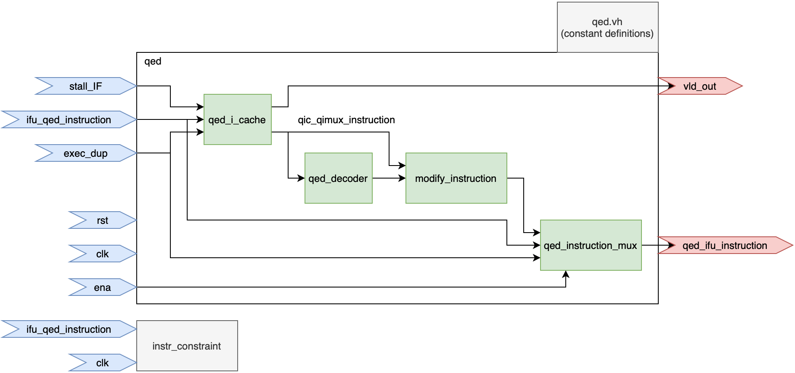

# Symbolic Quick Error Detection + Symbolic Starting States

A collection of Symbolic Quick Error Detection + Symbolic Starting States
demos on a variety of processor designs along with supplemental resources.

## Table of Contents

- [Overview](#overview)
- [Deployment](#deployment)
- [Contributors](#contributors)

## Overview

### Demos

Further detailed information can be found in each processor design's directory.
Setup and usage details can be found in the directory README.

- `steelcore_demo` contains a work-in-progress demo on steel

- `ridecore_demo` - contains a demo on ridecore

- `vscale_demo` containts a SQED + SSS demo on vscale

### Supplemental Resources

- `presentations/` contains slides and graphics related to this work

- `papers/` contains published papers and drafts related to this work

- `images` contains figures and images related to this work

## Deployment

We detail how to deploy SQED + SSS on a new design below using the Questa
toolchain step-by-step.

Most of the designer effort is spent in the following tasks:
- Specifying the ISA format for the `sqed-generator` and modifying the output
  as needed to work on your design
- Wiring up the QED Module to the design
- Writing the formal tool directives and properties to properly constrain
  the design for useful analysis.

### Step 1: Create the Recommended Directory Structure
Please review the directory structure details in the `demo_template/README.md`.
You can directly use the template as the starting point for deploying on a new
design.

`cp -r demo_template/ [DESIGN NAME]_demo/`

You should copy the unaltered version of the source design files into your
demo directory. Generally you will want to specify a certain commit hash
as a snapshot of the design you are verifying to ensure repeatability.

### Step 2: Generate the QED Module
Used the [sqed-generator](https://github.com/upscale-project/sqed-generator)
to generate the proper files for the `qed/` directory. Be sure to include
the design-independent QED files to place in the `qed/` directory.

Please follow the instructions in the repo for properly specifying ISA
format files and generating the required files.

### Step 3: Instantiate the Design Under Verification (DUV)
Use `patches.sh` to copy the relevant files from the source files into
`design/`

### Step 4: Wire Up the QED Module
In the module which instantiates the top-level pipeline, edit the design
to instantiate the QED module.

Generally this occurs in the following steps:

1. Instantiate the `qed` module in the pipeline
2. Disconnect the instruction signal at starting at the decode stage.
3. Connect the `qed_ifu_instruction` from the QED module to the decode stage
4. Ensure that `vld_out` is properly handled in the design
5. Add logic for tracking the committed number of instructions in the design.
6. Add logic for tracking when Symbolic-In-Flight (SIF) instructions have
   committed.

Our recommended workflow recommends copying the relevant design files from the
original design directory into the `patches/` directory and edit them directly.
They can then use `patch.sh` to copy the file into `design`.
This allows a faster iteration loop than creating patch files.

After finishing the deployment, the designer can then create patch files
and apply them with the `patch` tool to better preserve transparency of
changes to the original design.

For example, in order to wire-up the QED module, we copy the top level pipeline
from the original design directory into the `patches/` directory and
instantiate the QED module along with its supporting signals and logic in the
file. We then use the `patch.sh` script to simply `cp` this file into `design`
during `make design`. After we are sure wire-up is correct, we can export
the diffs as a patch file and only save the patch file in `patches/wire-up/`.

### Step 5: Create the `design_top` Module
Wrap the top-level pipeline module in a `design_top` module in `design_top.v`
which exposes only a clock and reset for inputs. All other I/O into the
pipeline must be handled accordingly. If the design comes standalone as a
processor core only, without memory, a memory can be instantiated here and
connected properly.

### Step 6: Specify Directives
In `formal/directives.tcl`, specify the following:

1. Clock properties (frequency)
2. Reset properties (typically tied to deasserted for SSS)
3. Cutpoints

Cutpoints are signals which the formal tool treats as inputs over time.
Typically we should have two cutpoints for SQED + SSS - 
the instruction signal and the `exec_dup` signal.

### Step 7: Specify Formal Properties
In `formal/formal_spec.sv` add proper assertions and constraints.
At a bare minimum, a QED consistency check and a valid instruction constraint
must be added. More properties may need to be added for more complex designs
to avoid spurious counterexamples.

### Step 8: Bind 
In `formal/formal_bind.sv`, bind the proper signals in `formal_spec.sv`
to the design's signals. Typically this only involves binding the registers we
are checking for QED consistency to the register file.

## Contributors

- [@eldrickm](https://github.com/eldrickm)
- [@jackhumphries](https://github.com/jackhumphries)
